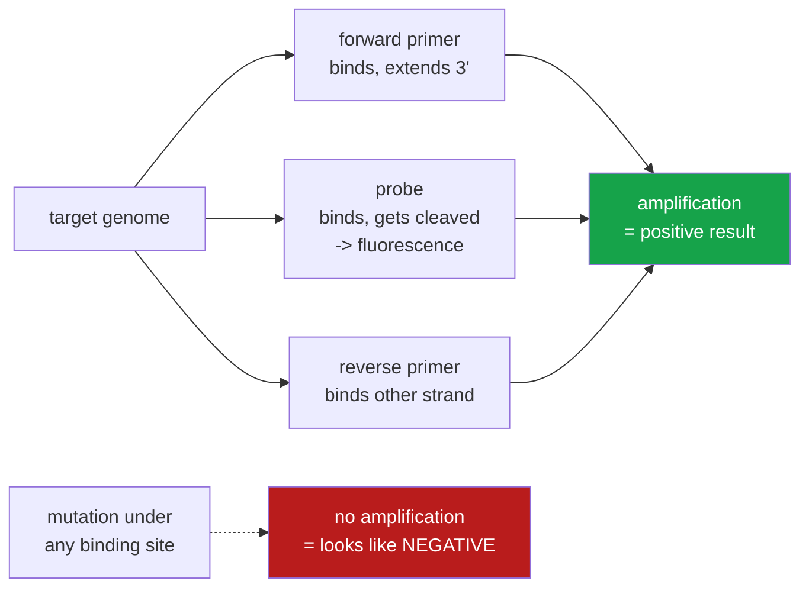

<h1 align="center">assay-drift (Python · GenBank · sequence analysis)</h1>
<p align="center"><i>Does this PCR test still match what is circulating?</i></p>

<p align="center">
  <a href="#results">Results</a> &middot;
  <a href="#what-a-pcr-test-actually-is">What a PCR test is</a> &middot;
  <a href="#how-it-works">How it works</a> &middot;
  <a href="#run-it">Run it</a> &middot;
  <a href="#scope">Scope</a> 
</p>

<p align="center">
  <a href="https://github.com/hammasbuilds/assay-drift/actions/workflows/ci.yml"></a>
  
  
  
  
  <a href="LICENSE"></a>
</p>

---

> ### Two of five published assays stopped matching their target entirely — 99.3% to 0.0% — and both stayed in clinical use. A third is 90.8% and is the one that broke. The difference is *where* the mutation landed.

A PCR diagnostic fails **silently**. When the target mutates under the primer binding site,
amplification stops, and a failed amplification looks exactly like a negative sample. There
is no error, no flag, nothing to notice.

This measures that from public data: 2,765 dated SARS-CoV-2 genomes from GenBank, spanning
2020 to 2026, against five published assays that clinical laboratories actually ran.

---

## Results

Share of sequences collected in each **quarter** that each assay matched **exactly**, and the
share it would plausibly **no longer detect**. Those are very different questions and the gap
between them is the whole story. Quarters are the granularity the committed run uses; every
number below comes from [`results/drift.json`](results/drift.json) and is reprinted by
`python demo.py`. First and last are the first and last quarters with at least 25 usable
sequences — `scripts/analyse.py --granularity year` regroups the same data by year.

| Assay | Exact match 2020-Q1 | Exact match 2026-Q3 | Change | Likely failing, worst quarter |
|---|---:|---:|---:|---|
| **CDC N1** | 99.3% | **0.0%** | **−99.3** | 10.9% (2026-Q3) |
| **Charité E** | 99.3% | **0.0%** | **−99.3** | 1.8% (2026-Q1) |
| **Charité RdRp** | 99.3% | 90.8% | −8.6 | **44.5% (2021-Q4)** |
| CDC N3 *(retired)* | 98.7% | 86.7% | −12.0 | 3.4% (2021-Q1) |
| **CDC N2** | 98.7% | 85.9% | −12.8 | **34.5% (2026-Q2)** |

**CDC N2 was the quiet one, and stopped being quiet in 2026.** It holds above 97% exact match
through 2024-Q4 while N1 — an assay targeting the *same gene*, 900 bases away — goes to zero,
which is the contrast that makes the rest of the table worth reading: this pipeline does not
simply report that everything drifts. But from 2025-Q4 onward N2's own likely-failing rate
leaves zero, and in 2026-Q1 and 2026-Q2 it is 28.7% (n=115) and 34.5% (n=29). That is a real
mutation, not an artefact, and the next section says exactly what it is and how much weight
the per-quarter figure can carry.

### The same data by year

Quarters are what the committed `results/drift.json` holds; `scripts/analyse.py --granularity
year` regroups the same 2,765 sequences and is the better view when a quarter's sample is
thin. Nothing in the story changes, and the N2 figure lands between its swinging quarters:

| Assay | Exact match 2020 | Exact match 2026 | Likely failing 2026 | Likely failing, worst year |
|---|---:|---:|---:|---|
| **CDC N1** | 99.0% | **0.0%** | 7.0% | 7.0% (2026) |
| **Charité E** | 98.8% | **0.0%** | 0.9% | 0.9% (2026) |
| **Charité RdRp** | 98.3% | 87.0% | 13.0% | **38.3% (2021)** |
| CDC N3 *(retired)* | 99.3% | 90.3% | 0.9% | 2.0% (2023) |
| **CDC N2** | 98.0% | 68.8% | **15.8%** | 15.8% (2026) |

### What happened to CDC N2 in 2026

The hits are a single substitution, **C29215T**, two bases from the 3′ end of the N2 reverse
primer — inside the window where a mismatch can stop extension, which is why one base moves
an assay straight from "drifted" to "likely failing". Its share of sequences where the site
is readable:

| Quarter | carrying C29215T | n |
|---|---:|---:|
| 2020-Q1 … 2024-Q4 | 0.0% | 153–420 per quarter |
| 2025-Q3 | 1.6% | 64 |
| 2025-Q4 | 3.8% | 319 |
| 2026-Q1 | 30.6% | 108 |
| 2026-Q2 | 34.5% | 29 |
| 2026-Q3 | 5.1% | 196 |

Three things are true at once, and reporting only the first would overstate it:

- **The mutation is real and it is new.** Zero in 2,000+ sequences before 2025, then a rise
  that starts in 2025-Q3. It is not a single bad record, an alignment slip or an `N`: the
  site is unambiguous in every sequence counted, and the base is `T` where the reference and
  the primer both say `C`.
- **The 2026-Q1/Q2 magnitude is a sampling artefact.** The hits are geographically clustered
  and arrive in consecutive accession blocks — single-submitter batches. `scripts/analyse.py`
  prints and stores where every 3′-window mutation was collected, over all years pooled:
  `USA: Wisconsin 24/74, USA: California 10/186, USA: Michigan 7/27, USA: Missouri 4/26,
  USA: Washington 4/163`. Within 2026 alone it is 53/333 sequences (15.9%) overall, 24/59 in
  Wisconsin and 0/69 in the UK. 2026-Q1 is Wisconsin-heavy and 2026-Q3 is California- and
  UK-heavy, which is most of the difference between 30.6% and 5.1%. GenBank is not a random
  sample of infections, and this is what that caveat looks like in practice.
- **2026-Q2 has n=29.** It clears the 25-sequence reporting floor and nothing more. Its
  34.5% is the worst quarter in the table and it rests on 10 sequences.

So: N2 can no longer be described as the stable control, and the honest statement is that a
3′-terminal mutation under its reverse primer appeared in 2025 and reached roughly 10–16% of
2026 sequences overall, with per-quarter figures swinging between 5% and 35% on where the
sequencing was done. Whether it costs real sensitivity is a laboratory question — see
**Scope**: no PCR was run here.

### Four mutations, found from raw sequence and named

The tool does not know about variants. It aligns oligos and counts, and names
whatever disagrees with the 2019 reference — run `python scripts/analyse.py`
and read `results/mutations.json`, or the per-assay tables it prints. Below
are the top hit for the four assays this README discusses; the same command
writes every oligo's top 5.

| Assay | Position in oligo | Genome coordinate | Change | Share of all sequences |
|---|---|---|---|---:|
| CDC N1 probe | base 3 of 24 (21 from the 3′ end) | **C28311T** | C→T | 76.6% |
| Charité E forward | base 2 of 26 (24 from the 3′ end) | **C26270T** | C→T | 76.5% |
| Charité RdRp forward | **1 base from the 3′ end** | **G15451A** | G→A | 11.1% |
| CDC N2 reverse | **2 bases from the 3′ end** | **C29215T** | C→T | 2.4% |

The first two are Omicron substitutions and the third is Delta's NSP12 G671S; the fourth is
the 2026 N2 signal above. The share column is over every sequence where the site is readable,
all years pooled — a mutation that is recent will look small there and large in its own
quarter, which is why the per-quarter tables exist.

### Why two assays at 0% are fine and one at 90.8% is not

**CDC N1 and Charité E lost their exact match completely, and kept working.** Their Omicron
mutations sit at base 3 of a probe and base 2 of a 26-base primer. Both weaken binding
slightly. Neither stops the reaction — and both assays remained in clinical use throughout.
N1's residual likely-failing rate (10.9% in 2026-Q3) comes from sequences carrying three or
more mismatches across the whole assay, not from a 3′-end hit.

**Charité RdRp is the one that actually broke, and worst while Delta circulated.** In
2021-Q4, 44.5% of sequences carried G15451A — one base from the 3′ terminus of its forward
primer. Polymerase extends from that terminus, so a mismatch there can stop amplification
outright. Its likely-failing rate hit **44.5% in 2021-Q4**, fell to 3.1% in 2022-Q4 when
Omicron displaced Delta, and runs at 9–24% across the 2025–2026 quarters.

An assay can drift almost completely and remain perfectly usable. An assay can look
healthy on a mismatch count and be broken. Only the position tells you which.

📊 **Full per-quarter tables: [`results/drift.json`](results/drift.json)**

---

## What a PCR test actually is

Three short synthetic DNA sequences that must bind a specific stretch of the target genome:



If the organism mutates under those sites, the test reports negative. That is the failure
mode this measures.

---

## How it works

**Sequences come from GenBank with their collection dates.** A record with no usable date
is dropped and counted — never defaulted to today, which would move old sequences into the
current period and corrupt exactly the trend being measured. 35 of 2,800 were dropped.

**Downloads are stratified by year.** Sorting newest-first and taking N gives a single
year of data, which cannot show drift at all.

**An `N` in the target is missing data, not a mismatch.** This is the load-bearing decision.
Sequencing quality changed enormously over the pandemic — in this run the exclusion rate runs from
0.0% of sequences in 2020-2022 and 0.1% in 2023 to 2.5% in 2024, and 10.1% for one assay in a
single quarter (CDC N1, 2024-Q4) — so counting unknown bases as mismatches would
manufacture a *time trend* out of laboratory practice and present it as viral drift. Oligos
with an unknown base under them are excluded from the rates and reported separately.

**A site has to be similar enough to be the site at all.** An 18-mer scored against every
offset of a 29,903-base genome will always find somewhere that matches to within 5 bases by
chance; brute force over the reference puts the best *wrong* site for the catalogue's fifteen
oligos at 27%–42% divergence. A candidate site is therefore capped at a fifth of the oligo's
length in definite mismatches, not at a flat number — a flat cap of 8 is 31% of a 26-mer but
44% of an 18-mer, and admitted a coincidence for ten of the fifteen. Above the cap the answer
is "no binding site", which is a different statement from "the site could not be read": with
all 18 bases of CDC N2's reverse primer masked as `N`, the flat cap reported a site 8,436
bases away with 7 mismatches as a usable measurement, where the honest answer — and now the
output — is the real locus with 18 unknown bases and excluded from every rate.

**The search has to be able to find a drifted site, not only a perfect one.** Candidate
positions come from exact seeds, and the seed length is computed from the oligo so that two
substitutions anywhere in it cannot break every seed. Fixed 8-base seeds at every fourth
offset gave an 18-mer three seeds covering bases 0-15, which left two of its bases in no
seed at all: enumerating every pair of positions, **31.4% of all two-mismatch sites in an
18-mer came back as "no binding site"** — a much stronger claim than "it has two
substitutions", and CDC N2's reverse primer is an 18-mer. It is now 0.0% at every oligo
length in the catalogue, and three-mismatch misses fell from 60.8% to 0.5%. This changed no
number in the committed run, because the mutations that circulate in these sites are single
substitutions at recurring positions and one mismatch was never missed; it matters for
`check`, where the primers and sequences are your own.

**Ambiguity codes in a primer are a real mixture.** `R` means the oligo was synthesised as
both A and G, so it genuinely matches both. Charité RdRp uses them deliberately, to catch
SARS-related viruses broadly. Treating `R` as the letter R reports that assay as broken
everywhere.

**A mismatch near the 3′ end is only special on a primer.** Polymerase extends from that
terminus. A hydrolysis probe is never extended — its 3′ end carries the quencher and is
chemically blocked — so the same mismatch there is an ordinary binding penalty.

---

## Run it

```bash
git clone https://github.com/hammasbuilds/assay-drift
cd assay-drift

python demo.py          # the setup check and the finding, no network, ~2s
pytest -q               # 106 tests, no network, no install step
```

Nothing to install — zero runtime dependencies, standard library only.

To rebuild the data from scratch:

```bash
python scripts/fetch.py --per-year 400    # ~10 min, polite to NCBI, cached for a month
python scripts/analyse.py
```

Or with `make`: `make demo`, `make test`, `make lint`, `make fetch`, `make analyse`.

### Your own primers, your own sequences

The same scoring rules, applied to files you supply — no network, no GenBank:

```bash
pip install -e .        # only needed for the CLI; demo and tests need no install
assay-drift check --primers examples/cdc_n2.tsv --sequences examples/two_genomes.fasta
```

```
sequence                verdict                 N2-F        N2-R        N2-P
NC_045512.2             perfect                  0mm         0mm         0mm
synthetic_C29215T       likely_failing           0mm      1mm/3'         0mm

perfect 1, drifted 0, likely_failing 1, unknown 0  (of 2)
```

The two shipped example sequences are the 2019 reference and the same genome carrying
C29215T, the 2026 N2 mutation above — one base, and the verdict changes. Point it at your
own files with `--primers my_assay.tsv --sequences genomes.fasta --json out.json`.

`my_assay.tsv` is one oligo per line, `name<TAB>role<TAB>sequence`, role being `forward`,
`reverse` or `probe`; `#` comments and blank lines are skipped. Each sequence comes back as
`perfect`, `drifted` (mismatched but still expected to amplify), `likely_failing` (an oligo
lost, a mismatch in a primer's last five bases, or three or more mismatches across the assay)
or `unknown` (an `N` under an oligo — not evidence either way). `--json` writes the per-oligo
positions, mismatch counts and unknown-base counts.

---

## Input

Five published assays, as the oligonucleotides clinical laboratories ran. Sources in
[`src/assaydrift/primers.py`](src/assaydrift/primers.py) — CDC-006-00019 rev.06 and
Corman et al. 2020, *Euro Surveill* 25(3).

## Output

`python demo.py` — every oligo against the 2019 reference genome first, because a mistyped
base would read as drift that is not there:

```
  oligo     role      len  position  mismatch   note
  N1-F      forward    20     28286         0
  N1-R      reverse    24     28334         0
  N1-P      probe      24     28308         0
  N2-F      forward    20     29163         0
  N2-R      reverse    18     29212         0
  N2-P      probe      23     29187         0
  N3-F      forward    22     28680         0
  ...
  RdRp-F    forward    22     15430         0
  RdRp-R    reverse    26     15504         1   known: S vs T, 14 bases from the 3' end
  RdRp-P    probe      25     15469         0

  14 of 15 match perfectly.
```

...then the finding:

```
  assay                            exact match        likely failing
  CDC N1            2020-Q1  99.3%  ->  2026-Q3   0.0%       10.9%   worst 10.9% (2026-Q3)
  CDC N2            2020-Q1  98.7%  ->  2026-Q3  85.9%        5.2%   worst 34.5% (2026-Q2)
  CDC N3 (retired)  2020-Q1  98.7%  ->  2026-Q3  86.7%        0.5%   worst 3.4% (2021-Q1)
  Charite E         2020-Q1  99.3%  ->  2026-Q3   0.0%        0.5%   worst 1.8% (2026-Q1)
  Charite RdRp *    2020-Q1  99.3%  ->  2026-Q3  90.8%        9.2%   worst 44.5% (2021-Q4)
```

*Shown as text rather than a chart: five assays over 24 quarters is a table, and a
chart here would be decoration that hides the sample size behind each point.*

---

## Scope

**It predicts, it does not test.** Every claim here is about sequence complementarity. No
PCR was run. Real amplification depends on melting temperature, salt, enzyme, cycling
conditions and concentration, and assays tolerate more mismatch in practice than a
thermodynamics-free model suggests. `likely_failing` is a hypothesis, not a result.

**No melting-temperature model.** A mismatch is counted by position and number, not by how
much it actually costs in ΔG. [`primer-designer`](https://github.com/hammasbuilds/primer-designer)
does the nearest-neighbour thermodynamics for the *design* side of this problem; wiring its
Tm calculation in here would turn `likely_failing` from a rule of thumb into an estimate.
That is the most valuable thing missing.

**`SEVERE_MISMATCH_LOAD = 3` is a judgement call**, stated in the source so it can be
argued with rather than buried. So is the five-base 3′ window.

**GenBank is not a random sample of infections.** Sequencing effort is wildly uneven by
country, time and lineage of interest, and outbreak investigations deliberately over-sample
the unusual. These rates describe deposited sequences, not circulating virus.

**400 genomes per year is a sample.** Enough to separate 0% from 98%, not enough to resolve
a two-point difference.

**One organism, five assays.** The method is general; the numbers are about SARS-CoV-2.

## Layout

```
src/assaydrift/ncbi.py      GenBank via E-utilities, rate-limited and cached
src/assaydrift/primers.py   five published assays, with sources
src/assaydrift/match.py     oligo alignment: IUPAC, unknown bases, strand, 3' end
src/assaydrift/analyze.py   grouping by collection date, rates, trend
src/assaydrift/cli.py       assay-drift check: your own primers against your own FASTA
scripts/fetch.py            year-stratified download
scripts/analyse.py          the report
examples/                   a primers TSV and two genomes, for the CLI quickstart
tests/                      106 tests, none touching the network
```

The reference genome is vendored at `tests/data/` as 9 KB of gzipped JSON with its sha256
pinned, so the suite never depends on NCBI being reachable.

## Also worth reading

| | |
|---|---|
| **[primer-designer](https://github.com/hammasbuilds/primer-designer)** | The other half: designing primers that survive drift, with real thermodynamics |
| **[clcuv-surveillance](https://github.com/hammasbuilds/clcuv-surveillance)** | Mutation atlas and novel-strain calls from viral sequence data |

## Keywords

PCR diagnostics &middot; primer mismatch &middot; assay drift &middot; GenBank &middot;
E-utilities &middot; SARS-CoV-2 &middot; molecular diagnostics &middot; false negatives
&middot; sequence analysis &middot; bioinformatics &middot; public health &middot;
variant surveillance &middot; oligonucleotide &middot; IUPAC

## Licence

MIT — see [LICENSE](LICENSE). The assay sequences are published in the cited sources; the
genomes are GenBank's.
