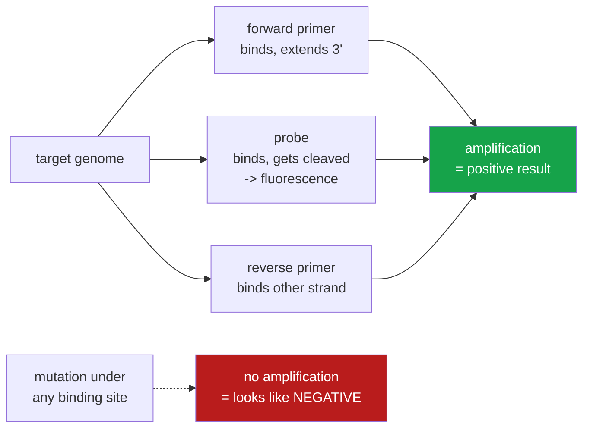

<h1 align="center">assay-drift (Python · GenBank · sequence analysis)</h1>
<p align="center"><i>Does this PCR test still match what is circulating?</i></p>

<p align="center">
  <a href="#the-result">The result</a> &middot;
  <a href="#what-a-pcr-test-actually-is">What a PCR test is</a> &middot;
  <a href="#how-it-works">How it works</a> &middot;
  <a href="#run-it">Run it</a> &middot;
  <a href="#what-this-does-not-do">What it does NOT do</a> &middot;
  <a href="#problems-hit-while-building-this">Problems hit</a>
</p>

<p align="center">
  <a href="https://github.com/hammasbuilds/assay-drift/actions/workflows/ci.yml"></a>
  
  
  
  
  <a href="LICENSE"></a>
</p>

---

> ### Two of five published assays stopped matching their target entirely — 98.9% to 0.0% — and neither is predicted to have stopped working. The difference is *where* the mutation landed.

A PCR diagnostic fails **silently**. When the target mutates under the primer binding site,
amplification stops, and a failed amplification looks exactly like a negative sample. There
is no error, no flag, nothing to notice.

This measures that from public data: 2,765 dated SARS-CoV-2 genomes from GenBank, spanning
2020 to 2026, against five published assays that clinical laboratories actually ran.

---

## The result

Share of sequences collected each year that each assay matched **exactly**, and the share
it would plausibly **no longer detect**. Those are very different questions and the gap
between them is the whole story.

| Assay | Exact match 2020 | Exact match 2026 | Change | Likely failing, worst year |
|---|---:|---:|---:|---|
| **CDC N1** | 98.9% | **0.0%** | **−98.9** | 5.9% (2026) |
| **Charité E** | 98.6% | **0.0%** | **−98.6** | 0.5% (2023) |
| **Charité RdRp** | 98.1% | 87.1% | −11.0 | **39.2% (2021)** |
| CDC N3 *(retired)* | 99.4% | 88.3% | −11.1 | 1.1% (2023) |
| **CDC N2** | 98.3% | 67.6% | −30.8 | 1.8% (2025) |

**CDC N2 is the control.** If the pipeline were simply reporting that everything drifts, N2
would drift too. It holds above 97% through 2024 while N1 — an assay targeting the *same
gene*, 900 bases away — goes to zero. That contrast is what makes the rest of the table
worth reading.

### Three mutations, found from raw sequence and named

The tool does not know about variants. It aligns oligos and counts. These fell out of it:

| Assay | Position in oligo | Genome coordinate | Change | What it is |
|---|---|---|---|---|
| CDC N1 probe | base 3 of 24 | **C28311T** | C→T | Omicron |
| Charité E forward | base 2 of 26 | **C26270T** | C→T | Omicron |
| Charité RdRp forward | **1 base from the 3′ end** | **G15451A** | G→A | Delta (NSP12 G671S) |

### Why two assays at 0% are fine and one at 87% is not

**CDC N1 and Charité E lost their exact match completely, and kept working.** Their Omicron
mutations sit at base 3 of a probe and base 2 of a 26-base primer. Both weaken binding
slightly. Neither stops the reaction — and both assays remained in clinical use throughout.

**Charité RdRp is the one that actually broke, and only for a while.** In 2021, 37.6% of
sequences carried G15451A — one base from the 3′ terminus of its forward primer. Polymerase
extends from that terminus, so a mismatch there can stop amplification outright. Its
likely-failing rate hit **39.2% in 2021**, fell to 2.8% in 2022 when Omicron displaced
Delta, and has climbed back to 12.9% by 2026.

An assay can drift almost completely and remain perfectly usable. An assay can look
healthy on a mismatch count and be broken. Only the position tells you which.

📊 **Full per-quarter tables: [`results/drift.json`](results/drift.json)**

---

## What a PCR test actually is

Three short synthetic DNA sequences that must bind a specific stretch of the target genome:



If the organism mutates under those sites, the test reports negative. That is the failure
mode this measures.

---

## How it works

**Sequences come from GenBank with their collection dates.** A record with no usable date
is dropped and counted — never defaulted to today, which would move old sequences into the
current period and corrupt exactly the trend being measured. 35 of 2,800 were dropped.

**Downloads are stratified by year.** Sorting newest-first and taking N gives a single
year of data, which cannot show drift at all.

**An `N` in the target is missing data, not a mismatch.** This is the load-bearing decision.
Sequencing quality changed enormously over the pandemic — the exclusion rate here runs from
0.5% to 44.8% depending on the year — so counting unknown bases as mismatches would
manufacture a *time trend* out of laboratory practice and present it as viral drift. Oligos
with an unknown base under them are excluded from the rates and reported separately.

**Ambiguity codes in a primer are a real mixture.** `R` means the oligo was synthesised as
both A and G, so it genuinely matches both. Charité RdRp uses them deliberately, to catch
SARS-related viruses broadly. Treating `R` as the letter R reports that assay as broken
everywhere.

**A mismatch near the 3′ end is only special on a primer.** Polymerase extends from that
terminus. A hydrolysis probe is never extended — its 3′ end carries the quencher and is
chemically blocked — so the same mismatch there is an ordinary binding penalty.

---

## Run it

```bash
git clone https://github.com/hammasbuilds/assay-drift
cd assay-drift

python demo.py          # the setup check and the finding, no network, ~2s
pytest -q               # 71 tests, no network, no install step
```

Nothing to install — zero runtime dependencies, standard library only.

To rebuild the data from scratch:

```bash
python scripts/fetch.py --per-year 400    # ~10 min, polite to NCBI, cached for a month
python scripts/analyse.py
```

Or with `make`: `make demo`, `make test`, `make lint`, `make fetch`, `make analyse`.

---

## Input

Five published assays, as the oligonucleotides clinical laboratories ran. Sources in
[`src/assaydrift/primers.py`](src/assaydrift/primers.py) — CDC-006-00019 rev.06 and
Corman et al. 2020, *Euro Surveill* 25(3).

## Output

`python demo.py` — every oligo against the 2019 reference genome first, because a mistyped
base would read as drift that is not there:

```
  oligo     role      len  position  mismatch   note
  N1-F      forward    20     28286         0
  N1-P      probe      24     28308         0
  N2-F      forward    20     29163         0
  E-F       forward    26     26268         0
  RdRp-F    forward    22     15430         0
  RdRp-R    reverse    26     15504         1   known: S vs T, 14 bases from the 3' end
  ...
  14 of 15 match perfectly.
```

...then the finding:

```
  assay                            exact match        likely failing
  CDC N1            2020  98.9%  ->  2026   0.0%        5.9%   worst 5.9% (2026)
  CDC N2            2020  98.3%  ->  2026  67.6%        0.0%   worst 1.8% (2025)
  CDC N3 (retired)  2020  99.4%  ->  2026  88.3%        0.4%   worst 1.1% (2023)
  Charite E         2020  98.6%  ->  2026   0.0%        0.4%   worst 0.5% (2023)
  Charite RdRp *    2020  98.1%  ->  2026  87.1%       12.9%   worst 39.2% (2021)
```

*Shown as text rather than a chart: five assays over seven years is a table, and a
chart here would be decoration that hides the sample size behind each point.*

---

## What this does NOT do

**It predicts, it does not test.** Every claim here is about sequence complementarity. No
PCR was run. Real amplification depends on melting temperature, salt, enzyme, cycling
conditions and concentration, and assays tolerate more mismatch in practice than a
thermodynamics-free model suggests. `likely_failing` is a hypothesis, not a result.

**No melting-temperature model.** A mismatch is counted by position and number, not by how
much it actually costs in ΔG. [`primer-designer`](https://github.com/hammasbuilds/primer-designer)
does the nearest-neighbour thermodynamics for the *design* side of this problem; wiring its
Tm calculation in here would turn `likely_failing` from a rule of thumb into an estimate.
That is the most valuable thing missing.

**`SEVERE_MISMATCH_LOAD = 3` is a judgement call**, stated in the source so it can be
argued with rather than buried. So is the five-base 3′ window.

**GenBank is not a random sample of infections.** Sequencing effort is wildly uneven by
country, time and lineage of interest, and outbreak investigations deliberately over-sample
the unusual. These rates describe deposited sequences, not circulating virus.

**400 genomes per year is a sample.** Enough to separate 0% from 98%, not enough to resolve
a two-point difference.

**One organism, five assays.** The method is general; the numbers are about SARS-CoV-2.

---

## Problems hit while building this

**Counting `N` as a mismatch would have invented the entire finding.** Sequencing quality
varies from 0.5% to 44.8% unknown bases by year in this dataset. Treating those as
disagreements would produce a confident downward trend that is a measure of laboratory
practice, not of the virus.

**The 3′-end rule was being applied to probes.** Polymerase extends from a primer's 3′
terminus, which is why a mismatch there is fatal — but a hydrolysis probe is never extended.
The Omicron mutation under the CDC N1 probe happens to sit two bases from that probe's 3′
end, so the first version of this reported N1 as having failed outright in 2022. Meaningless
for a probe, fatal for a primer, and the code did not know the difference.

**"Still works" was defined as "matches perfectly", which is an overclaim.** Under that
definition CDC N1 and Charité E read 0% from 2022 onward, while laboratories were running
both successfully. A single mismatch near the 5′ end of a 26-base primer barely moves the
melting temperature. Split into `perfect` and `likely_failing`, which is the more
interesting pair anyway.

**One primer did not match the reference genome — and it was not a typo.** The rule in
`primers.py` is that an oligo failing against NC_045512.2 is a transcription error. One
failed. The Charité RdRp reverse primer carries `S` (G or C) where SARS-CoV-2 has `T`: it
was designed for SARS-related coronaviruses from sequences predating SARS-CoV-2, so that
assay has **never** matched its target perfectly. It sits 14 bases from the 3′ end, which is
why it worked anyway. Recorded in `KNOWN_REFERENCE_MISMATCHES` with its reason, and
subtracted as a baseline so the assay is not scored as drifted on day one — rather than
loosening the test that caught it.

**A palindromic test fixture silently disabled a test.** The strand-handling test used a
primer that is its own reverse complement, so it was present on both strands and the test
could not have failed whatever the code did.

---

## Layout

```
src/assaydrift/ncbi.py      GenBank via E-utilities, rate-limited and cached
src/assaydrift/primers.py   five published assays, with sources
src/assaydrift/match.py     oligo alignment: IUPAC, unknown bases, strand, 3' end
src/assaydrift/analyze.py   grouping by collection date, rates, trend
scripts/fetch.py            year-stratified download
scripts/analyse.py          the report
tests/                      71 tests, none touching the network
```

The reference genome is vendored at `tests/data/` as 9 KB of gzipped JSON with its sha256
pinned, so the suite never depends on NCBI being reachable.

## Also worth reading

| | |
|---|---|
| **[primer-designer](https://github.com/hammasbuilds/primer-designer)** | The other half: designing primers that survive drift, with real thermodynamics |
| **[clcuv-surveillance](https://github.com/hammasbuilds/clcuv-surveillance)** | Mutation atlas and novel-strain calls from viral sequence data |

## Keywords

PCR diagnostics &middot; primer mismatch &middot; assay drift &middot; GenBank &middot;
E-utilities &middot; SARS-CoV-2 &middot; molecular diagnostics &middot; false negatives
&middot; sequence analysis &middot; bioinformatics &middot; public health &middot;
variant surveillance &middot; oligonucleotide &middot; IUPAC

## Licence

MIT — see [LICENSE](LICENSE). The assay sequences are published in the cited sources; the
genomes are GenBank's.
